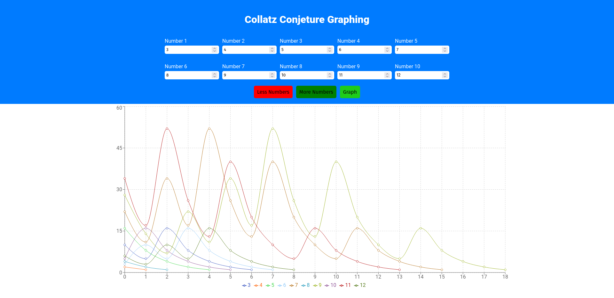

# Collatz Conjecture Web App

This project is a web app that generates a graph illustrating the Collatz Conjecture for a given number until it reaches 1, where the sequence eventually enters a loop.

## Features

Input a starting number/s to initiate the Collatz Conjecture graph.

## Tech Stack

Front-end: HTML, CSS, TypeScript, React, Recharts, Vite

## Dependencies and Setup

1. Clone the repository.
2. Install dependencies using ```npm install```.
3. Run the application locally with ```npm run dev```.

## Screenshots


